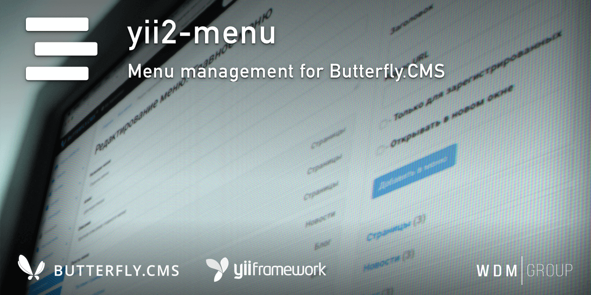

# Yii2 Menu module
Module for creating and managing menus. It has its own component for displaying menu items in the front-end.

This module is an integral part of the [Butterfly.СMS](https://butterflycms.com/) content management system, but can also be used as an standalone extension.

Copyrights (c) 2019-2020 [W.D.M.Group, Ukraine](https://wdmg.com.ua/)

# Requirements 
* PHP 5.6 or higher
* Yii2 v.2.0.35 and newest
* [Yii2 Base](https://github.com/wdmg/yii2-base) module (required)

# Installation
To install the module, run the following command in the console:

`$ composer require "wdmg/yii2-menu"`

After configure db connection, run the following command in the console:

`$ php yii menu/init`

And select the operation you want to perform:
  1) Apply all module migrations
  2) Revert all module migrations

# Migrations
In any case, you can execute the migration and create the initial data, run the following command in the console:

`$ php yii migrate --migrationPath=@vendor/wdmg/yii2-menu/migrations`

# Configure

To add a module to the project, add the following data in your configuration file:

    'modules' => [
        ...
        'menu' => [
            'class' => 'wdmg\menu\Module',
            'routePrefix' => 'admin'
        ],
        ...
    ],

# Usage examples
To build the ActiveForm with fields you may use the component method Yii::$app->menu->build() with `id` or `alias` of form item.

**View in frontend**

    <?php
        use yii\bootstrap\Nav;
        ...
    ?>
        
    <?= Nav::widget([
        'options' => ['class' => 'navbar-nav'],
        'items' => \Yii::$app->menu->getItems(1, true),
        ...
    ]); ?>
    ...
    

# Routing
Use the `Module::dashboardNavItems()` method of the module to generate a navigation items list for NavBar, like this:

    <?php
        echo Nav::widget([
        'options' => ['class' => 'navbar-nav navbar-right'],
            'label' => 'Modules',
            'items' => [
                Yii::$app->getModule('menu')->dashboardNavItems(),
                ...
            ]
        ]);
    ?>

# Status and version [ready to use]
* v.1.0.0 - Component for output menu items.
* v.0.0.1 - CRUD, assets, menu item form.